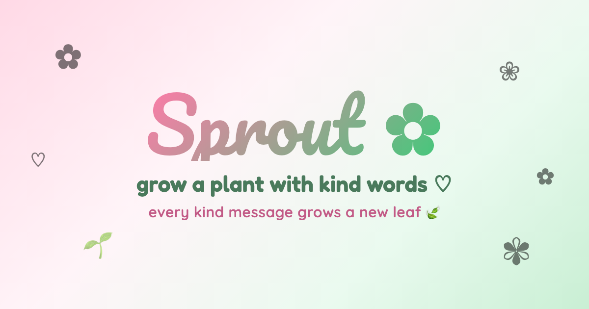
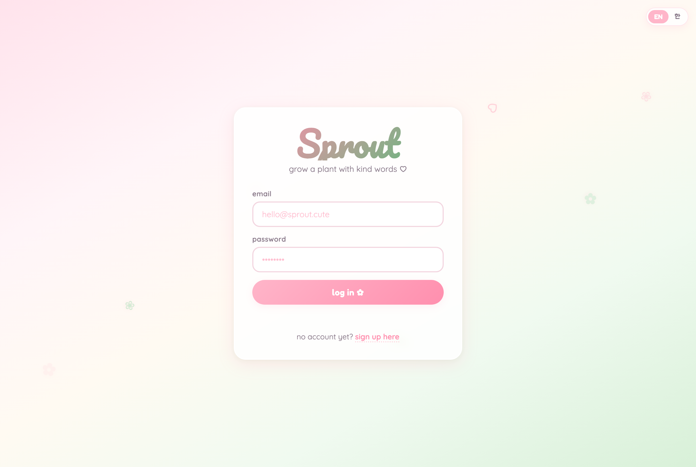

<div align="center">



# Sprout ✿

**A cozy social web app where your plant grows from the kind words other people send you.**
Every message someone leaves becomes a new leaf — watch a seed bloom into a flourishing plant, one bit of kindness at a time.

[](https://sprout-flowers.vercel.app)
&nbsp;
[](https://clairekim59.github.io/)


</div>

---

## ✿ What it is

Sprout turns encouragement into something you can *grow*. You plant a seed, share your nickname, and as friends (or kind strangers) send you little notes, each one sprouts as a leaf on your plant. Pass through six growth stages — seed → sprout → sapling → bush → blooming → flourishing — then **graduate** your plant into your garden of memories and start a fresh seed.

> Built end-to-end as a solo project: product design, UI, database schema, security policies, and deployment.

<div align="center">
  
</div>

## ✿ Features

- 🌱 **Living plant** — a procedurally drawn SVG plant that visibly grows with every kind message and changes its silhouette across six growth stages.
- 🎁 **Mystery seed → 6 species** — each new seed grows into one of six distinct plants (fern, rose, sunflower, lavender, cactus, cherry blossom), each with its own leaves, blooms, and palette.
- 💌 **Send kind words** — leave notes for neighbors by nickname or email, optionally anonymously, with a type-ahead neighbor picker.
- 🔔 **Unread notifications** — a message you haven't opened stays unread until you actually read it, tracked server-side so it survives reloads, devices, and offline gaps.
- 🏡 **Neighbors** — friend requests with accept / decline / auto-accept, so you can water each other's plants.
- 🪴 **Garden of memories** — graduated plants are kept as keepsakes you can revisit (or remove).
- 🔗 **Shareable plant links** — a public, read-only `/p/<id>` page for any plant, with **per-plant link previews** (OpenGraph) that unfurl in messengers like KakaoTalk and iMessage. Guests can tap *“send a kind word”* and are routed to sign up, then dropped straight into a pre-addressed note.
- 🌏 **Bilingual** — full English / 한국어 support with a live language toggle.

## ✿ Engineering highlights

This is a deliberately **dependency-free, build-free** app — every piece is hand-built, which makes the architecture easy to read and the engineering choices visible:

| Area | Approach |
|---|---|
| **Frontend** | Vanilla JS single-page app with hand-rolled view routing, a custom i18n layer, and **zero framework / zero build step** — just static files. |
| **Plant rendering** | Procedural **SVG** generation: stems, species-aware leaf/flower shapes, growth stages, and gradients computed from the leaf count at render time. |
| **Database** | **Supabase Postgres** with **Row-Level Security** on every table. Sensitive operations run through `SECURITY DEFINER` RPCs (`graduate_plant`, `enable_plant_share`, `get_shared_plant`, `mark_message_read`, `accept_friend_request`) so clients can only ever touch their own data. |
| **Auth** | Supabase email/password with a profile + active-plant bootstrapped by Postgres triggers on sign-up. |
| **Data integrity** | Triggers keep `leaf_count` in sync, auto-attach incoming messages to the recipient's active plant, and enforce one active plant per user + unique nicknames. |
| **Link previews** | A **Vercel serverless function** server-renders per-plant OpenGraph/Twitter tags for `/p/<id>` (crawlers don't run JS), then serves the same SPA to humans via an injected `<base>` tag. |
| **Public sharing** | The read-only shared view calls the API as the **anonymous role** by design, so a viewer's login state can never break someone else's public plant. |

## ✿ Tech stack

**Frontend:** HTML · CSS · vanilla JavaScript (no framework, no bundler)
**Backend:** Supabase (Postgres, Auth, Row-Level Security, RPC functions, triggers)
**Hosting:** Vercel (static hosting + a serverless function for link previews)

## ✿ Project structure

```
sprout-flowers/
├── index.html        # app shell + all views (login, onboarding, garden, shared)
├── app.js            # SPA logic: routing, modals, notifications, sharing
├── plant.js          # procedural SVG plant rendering (6 species, growth stages)
├── db.js             # Supabase data layer
├── i18n.js           # English / 한국어 translations + runtime switching
├── styles.css        # the whole pink→green look & feel
├── growth.html       # plant growth gallery
├── api/share.js      # Vercel function — per-plant OpenGraph link previews
└── supabase-*.sql    # schema, RLS policies, triggers, and RPCs
```

## ✿ Running it locally

It's just static files, so any static server works:

```bash
git clone https://github.com/clairekim59/sprout-flowers.git
cd sprout-flowers
python3 -m http.server 8000   # then open http://localhost:8000
```

To run against your own backend, create a free [Supabase](https://supabase.com) project, run the `supabase-setup.sql` and `supabase-migration-*.sql` files in the SQL editor (in filename order), and drop your project URL + anon key into `config.js`. The anon key is safe to expose — access is governed entirely by Row-Level Security.

## ✿ About the developer

Built with ♡ by **Claire Kim** — I like turning small, human ideas into polished full-stack products and sweating the details from database policies to micro-interactions.

🌐 **Portfolio:** [clairekim59.github.io](https://clairekim59.github.io/)
🐙 **GitHub:** [@clairekim59](https://github.com/clairekim59)

## ✿ License

[MIT](./LICENSE) © 2026 Claire Kim
